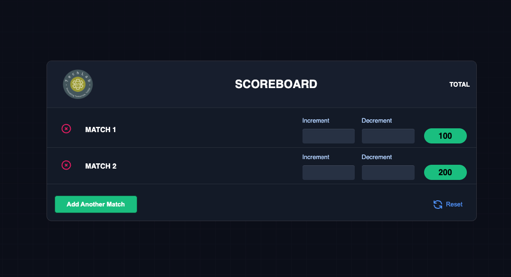

# Techlab - Scoreboard

## Overview

This project is a simple scoreboard application built using HTML, CSS, and
JavaScript. It allows users to keep track of scores for multiple matches and
provides functionality to increment, decrement, and reset scores for each match.

## Project Structure

- `index.html`: Contains the HTML structure for the scoreboard interface.
- `style.css`: Stylesheet file for customizing the appearance of the scoreboard.
- `script.js`: JavaScript file responsible for managing match data, handling
  user actions (increment, decrement, reset), and updating the UI dynamically
  using Redux for state management.

## Features

- **Add Match:** Users can dynamically add new matches to the scoreboard.
- **Increment and Decrement:** Allows users to increase or decrease scores for
  each match individually.
- **Reset:** Provides the option to reset scores for all matches to zero.

## Getting Started

1. Clone the repository:
   `git clone https://github.com/your-username/techlab-scoreboard.git`
2. Open `index.html` in your web browser to view the scoreboard interface.

## Usage

- Click on "Add Another Match" to create a new match entry.
- Enter increment or decrement values in the respective input fields and submit
  to update scores.
- Use the "Reset" button to reset all match scores to zero.

## Technologies Used

- HTML
- CSS
- JavaScript
- Redux (for state management)

## Deployed Live Link

The project is deployed and accessible live at
[https://techlab-scoreboard.vercel.app/](https://techlab-scoreboard.vercel.app/).

